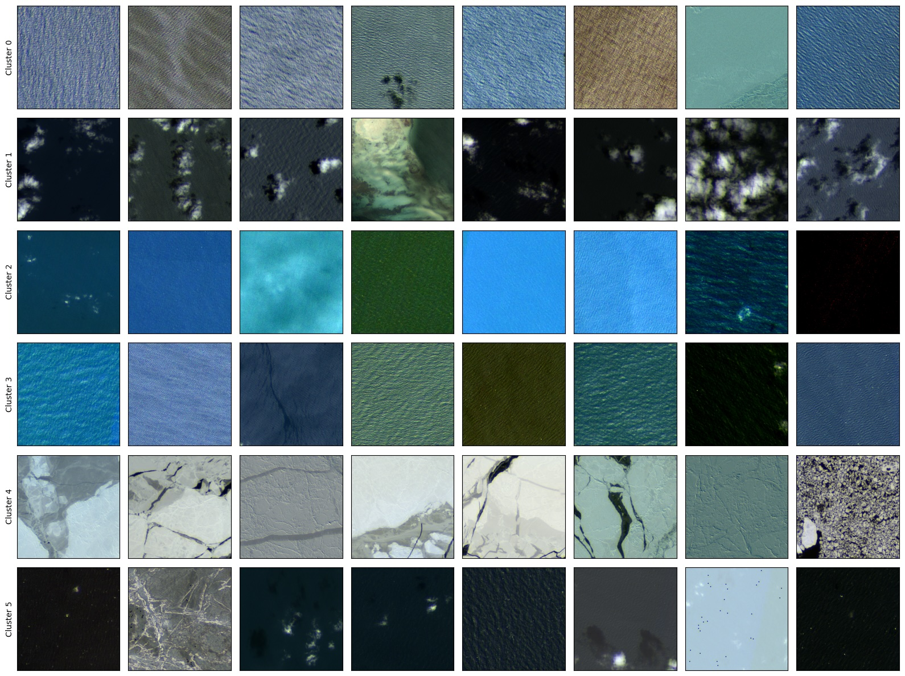
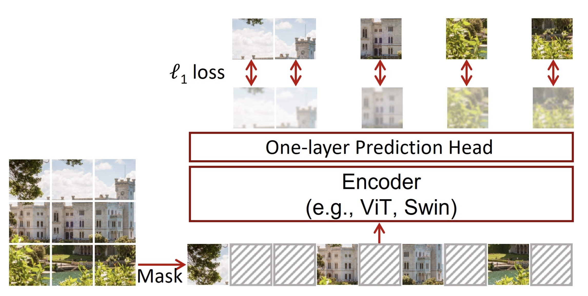

# Hydro -- A Foundation Model for Water in Satellite Imagery

<p align="center">
    <br/>
</p>

This repo started out as mostly /s and is a work in progress side project, but maybe something useful or interesting will happen.

### Motivation

There are many foundation models for remote sensing but nearly all of them focus on imagery of land. The earth is made of ~71% water. **ML 4 Water needs some more love and attention**. Therefore, we perform pretraining on a large-scale dataset of Sentinel-2 imagery containing water bodies for use in downstream applications such as bathmetry and hydrology.

### Progress

<p align="center">
    <br/>
</p>

We pretrain a [Swin v2 Transformer](https://arxiv.org/abs/2111.09883) encoder using the **SimMIM** method from the paper, ["SimMIM: A Simple Framework for Masked Image Modeling"](https://arxiv.org/abs/2111.09886), which is an efficient variation of the [Masked Autoencoder (MAE)](https://arxiv.org/abs/2111.06377) self-supervised learning framework.

Our pretraining dataset consists of 100k sampled 256x256 Sentinel-2 patches containing water from around the globe.

### Usage

Clone the repo with submodules

```bash
git clone --recurse-submodules https://github.com/isaaccorley/hydro-foundation-model.git
```

This repo really only requires packages that torchgeo installs so go ahead and `pip install torchgeo`

To pretrain a model you can run the following. Note to change some parameters you can edit the config file in the `configs/hydro/` folder.

```bash
cd Swin-Transformer
bash hydro_pretrain.sh
```

Loading a pretrained model as a classifier. Make sure you define MODEL.PRETRAINED as the path to your downloaded checkpoint on your config like below:

```yaml
MODEL:
  TYPE: swinv2
  NAME: hydro_simmim_pretrain
  PRETRAINED: checkpoints/ckpt_epoch_130.pth```
```

Load the checkpoint as a classifier like so

```python
import torch
from src.model import swin_v2

config_path = "checkpoints/hydro_simmim_pretrain_swinv2_base_img256_window16_800ep.yaml"
model, transforms, config = swin_v2(config_path)
```

Some helper methods are provided with the model for different use cases

```python
import torch

# Reset the classifier head to your desired number of classes
model.reset_classifier(num_classes=10)


# Extract image level embeddings
x = torch.randn(1, 12, 256, 256)
x = transforms(x)
model.forward_features(x)  # (1, 1024)

# Extract intermediate feature maps
x = torch.randn(1, 12, 256, 256)
x = transforms(x)
features = model.get_intermediate_layers(x, n=(0, 1, 2, 3, 4), reshape=True)
for i, f in enumerate(features):
    print(i, f.shape)

"""
0 torch.Size([1, 128, 64, 64])
1 torch.Size([1, 256, 32, 32])
2 torch.Size([1, 512, 16, 16])
3 torch.Size([1, 1024, 8, 8])
4 torch.Size([1, 1024, 8, 8])
"""
```

An example notebook with this code is available at `embed.ipynb`.

### Evaluation

We plan to evaluate the model on a few bathymetry, hydrology, and other benchmark datasets. This repo currently contains dataset code for evaluating on the [Marine Debris Archive (MARIDA)](https://marine-debris.github.io/) dataset which is in progress.

### Cite

If you use our pretrained models in you work please cite the following:

```bash
@misc{Corley:2024,
  Author = {Isaac Corley, Caleb Robinson},
  Title = {Hydro Foundation Model},
  Year = {2024},
  Publisher = {GitHub},
  Journal = {GitHub repository},
  Howpublished = {\url{https://github.com/isaaccorley/hydro-foundation-model}}
}
```
